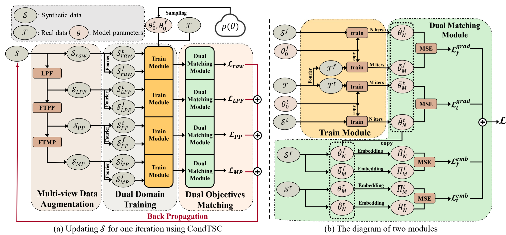

# Time Series Dataset Condensation via Dual Domain Matching [KDD2024]



## Data
The data is in https://www.dropbox.com/scl/fi/izu5d5gto7q84tezc2pc1/TimeSeriesData.zip?rlkey=qeqd2qeyse6trlm1t6yf6bppu&dl=0

Please download it and unzip it in `./data` folder

## Environment
The code is implemented in pytorch 1.10.0, CUDA version 11.3, python 3.7.0.

```bash
pip install torch==1.10.0+cu113 -f https://download.pytorch.org/whl/torch_stable.html
```


## Reproducibility
The default configs of the four datasets are set in `./config`.
To reproduce the result, first we need to get the training trajectory:
```bash
bash DCDDM_buffer.sh
```
Then we need to run the training code
```bash
bash DCDDM_distill.sh
```

The default hyper-parameters and experiment setting is in the .sh file.
Default we run the experiment for `HAR` dataset of $spc=5$.